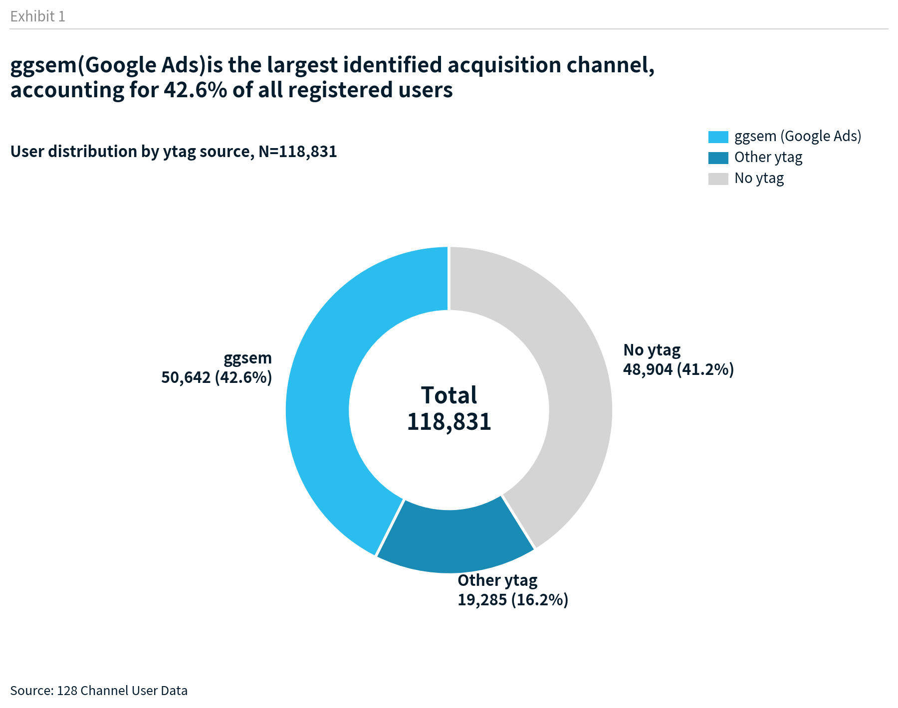
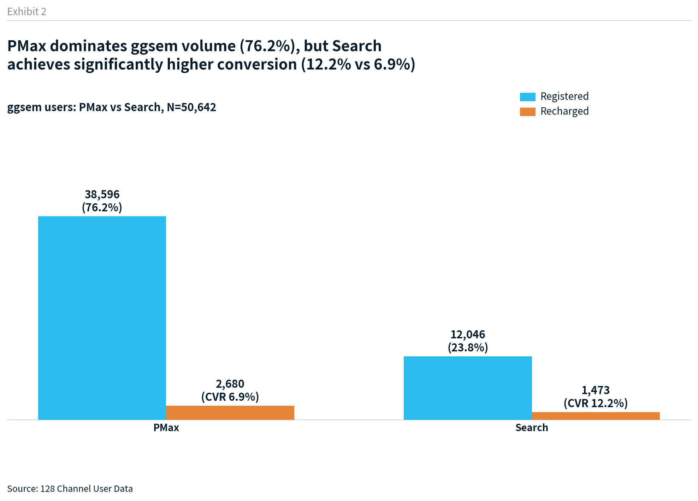
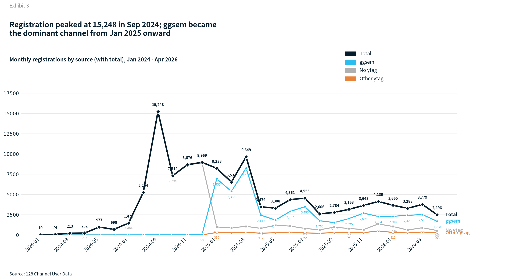
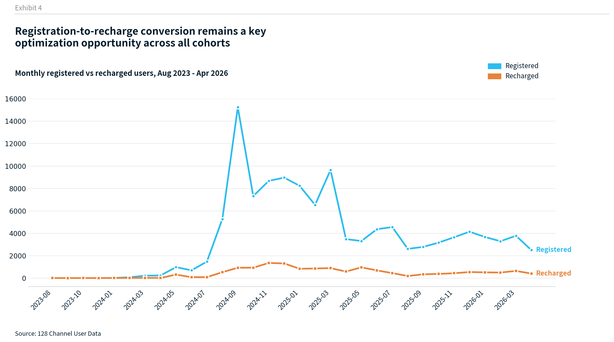
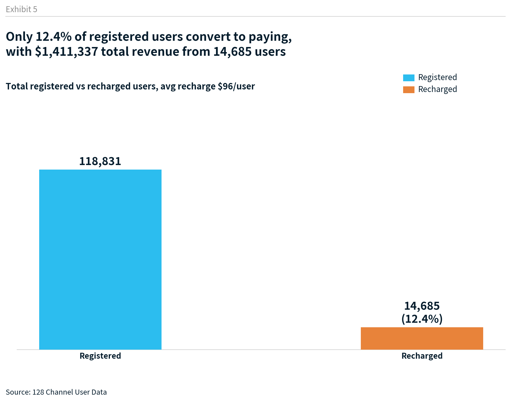
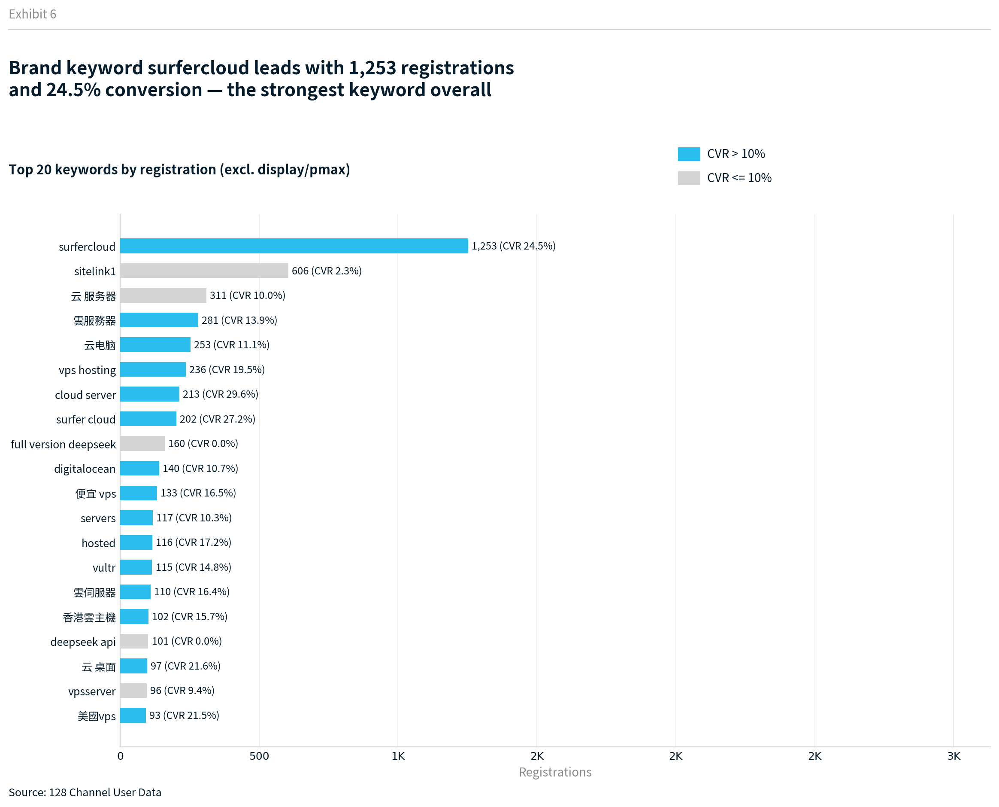
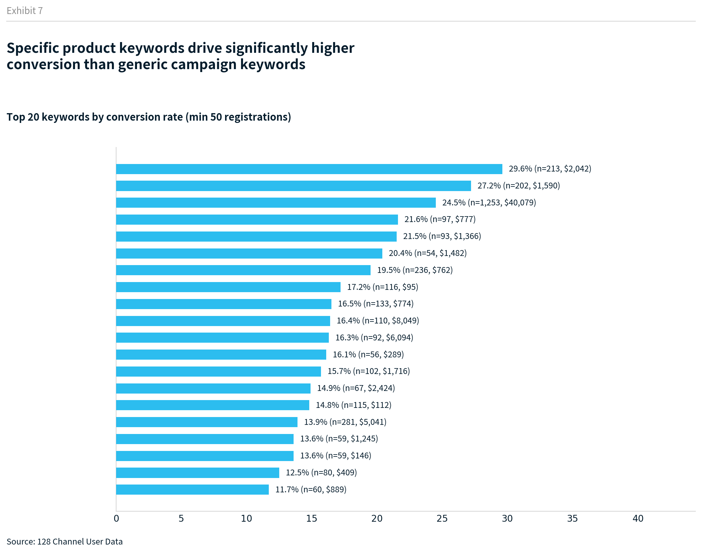

# 128渠道存量用户数据分析报告

> 数据范围：2023-08 ~ 2026-04 | 总用户量：118,831 | 分析时间：2026-04-22

---

## 一、ytag来源占比分析

### 1.1 整体用户来源分布

| 来源类型 | 用户数 | 占比 | 充值人数 | 充值转化率 | 总收入 |
|---------|--------|------|---------|-----------|--------|
| **No ytag（0或空）** | **63,341** | **53.3%** | 9,479 | 15.0% | $883,723 |
| **ggsem (Google Ads)** | **50,642** | **42.6%** | 4,153 | 8.2% | $254,850 |
| Other ytag（其他渠道） | 4,848 | 4.1% | 1,053 | 21.7% | $272,764 |

> 分类逻辑：综合ytag为0或NaN空值 → No ytag；综合ytag含"ggsem"字符 → ggsem；其余 → Other ytag

**核心发现：**
- 超过一半用户（53.3%）没有ytag归因标记，建议补全追踪
- ggsem是最大的已标记渠道（42.6%），但充值转化率仅8.2%，低于整体均值
- Other ytag（博客推荐、朋友介绍等自然渠道）虽然只有4.1%，但转化率最高达21.7%

### 1.2 ggsem用户中PMax vs Search占比

| 投放类型 | 用户数 | 占ggsem比例 | 充值人数 | 充值转化率 | 总收入 |
|---------|--------|------------|---------|-----------|--------|
| **PMax** | **38,596** | **76.2%** | 2,680 | 6.9% | $105,963 |
| **Search** | **12,046** | **23.8%** | 1,473 | 12.2% | $148,887 |

> 分类逻辑：综合ytag整体含"pmax"或"display"字符 → PMax；其余 → Search

**核心发现：**
- PMax占ggsem的76.2%用户量，是主力拉新引擎
- Search虽然用户量少，但**充值转化率远高于PMax**（12.2% vs 6.9%），且总收入更高（$148,887 vs $105,963）
- Search用户质量明显更优，人均收入$101 vs PMax的$40

---

## 二、月注册量趋势

### 2.1 分渠道月注册量趋势

ggsem从**2025年1月**起才开始大规模投放，此前注册主要来自No ytag渠道。

| 阶段 | ggsem月均 | No ytag月均 | Other ytag月均 |
|------|----------|------------|---------------|
| 2024-01~2024-12 | 11 | 4,165 | 3 |
| 2025-01~2025-12 | 3,280 | 939 | 303 |
| 2026-01~2026-04 | 2,237 | 775 | 295 |

> 说明：2024年ggsem几乎为零，No ytag占绝对主体；2025年起ggsem成为主力

### 2.2 月度注册-充值趋势

> **指标定义：** "充值人数"指**当月注册的用户中，截至数据提取日（2026-04-21）有过任何充值行为的用户数**。"充值转化率"= 充值人数 / 当月注册量。

| 月份 | 注册量 | 充值人数 | 充值转化率 |
|------|--------|---------|-----------|
| 2024-05 | 977 | 306 | 31.3% |
| 2024-08 | 5,264 | 524 | 10.0% |
| 2024-09 | 15,248 | 922 | 6.0% |
| 2024-11 | 8,676 | 1,347 | 15.5% |
| 2025-01 | 8,238 | 830 | 10.1% |
| 2025-03 | 9,649 | 889 | 9.2% |
| 2025-05 | 3,308 | 955 | 28.9% |
| 2026-03 | 3,779 | 638 | 16.9% |
| 2026-04 | 2,496 | 400 | 16.0% |

> 完整月度数据见 `output/monthly_registration_data.csv`
> 分渠道月度数据见 `output/monthly_registration_by_source.csv`

**趋势洞察：**
- 注册量高峰期（2024-09：15,248）充值转化率仅6.0%，量大质低
- 2025-05转化率达28.9%，注册量不大但质量极高
- 近期（2026 Q1）转化率稳定在15-17%，表现健康
- 早期注册用户有更长时间窗口完成充值，因此早期月份转化率天然偏高

---

## 三、注册客户 vs 充值客户

### 3.1 整体转化

| 指标 | 数值 |
|------|------|
| 总注册用户 | 118,831 |
| 充值用户 | 14,685 (12.4%) |
| 总充值金额 | $1,411,337 |
| 人均充值金额 | $96 |

---

## 四、关键词分析

### 4.1 Top 20关键词（按注册量）

| 关键词 | 注册量 | 充值人数 | 转化率 | 总收入 |
|--------|--------|---------|--------|--------|
| display | 19,572 | 879 | 4.5% | $26,620 |
| pmax | 18,752 | 1,801 | 9.6% | $79,344 |
| surfercloud | 1,253 | 307 | 24.5% | $40,079 |
| sitelink1 | 606 | 14 | 2.3% | $391 |
| 云 服务器 | 311 | 31 | 10.0% | $2,546 |
| 雲服務器 | 281 | 39 | 13.9% | $5,041 |
| 云电脑 | 253 | 28 | 11.1% | $4,314 |
| vps hosting | 236 | 46 | 19.5% | $762 |
| cloud server | 213 | 63 | 29.6% | $2,042 |
| surfer cloud | 202 | 55 | 27.2% | $1,590 |

### 4.2 高转化关键词排行（最少50注册）

| 关键词 | 转化率 | 注册量 | 总收入 |
|--------|--------|--------|--------|
| cloud server | 29.6% | 213 | $2,042 |
| surfer cloud | 27.2% | 202 | $1,590 |
| surfercloud | 24.5% | 1,253 | $40,079 |
| 云 桌面 | 21.6% | 97 | $777 |
| 美國vps | 21.5% | 93 | $1,366 |
| 國外服務器 | 20.4% | 54 | $1,482 |
| vps hosting | 19.5% | 236 | $762 |

### 4.3 关键词洞察

1. **品牌词效果最好**：surfercloud/surfer cloud转化率24-29%，远超泛词
2. **display质量最差**：19,572注册但转化仅4.5%，ROI需重新评估
3. **PMax性价比较优**：转化率9.6%是display的2倍，且人均充值$44
4. **中文关键词有潜力**：雲伺服器(16.4%)、雲服務器(13.9%)表现不错，且人均充值高
5. **DeepSeek相关词零转化**：full version deepseek(160注册/0充值)、deepseek api(101注册/0充值)，纯蹭热度流量

---

## 五、核心建议

### 🔴 立即行动
1. **补全ytag追踪**：53.3%用户无来源标记，严重影响归因分析和ROI计算
2. **优化display投放**：4.5%转化率、$26,620总收入 vs 19,572注册量，ROI低

### 🟡 短期优化
3. **加大品牌词投入**：surfercloud系列关键词转化率20%+，ARPU高，值得追加预算
4. **砍掉零转化词**：deepseek相关词带来注册但0充值，建议加入否定关键词
5. **拓展中文长尾词**：云桌面、云电脑等词转化率10-20%+，可以扩量
6. **Search vs PMax预算再分配**：Search的CVR(12.2%)几乎是PMax(6.9%)的两倍，人均收入$101 vs $40，考虑加大Search预算占比

### 🟢 长期策略
7. **重新评估ggsem整体ROI**：ggsem转化率仅8.2%，总收入$254,850；而Other ytag 4,848人带来$272,764收入，说明自然渠道性价比远高于付费投放
8. **激活存量低转化用户**：2024-09高峰期用户转化率仅6%，可针对这批低转化存量做定向激活

---

*报告生成时间：2026-04-22 | 数据来源：128渠道存量用户数据表*
