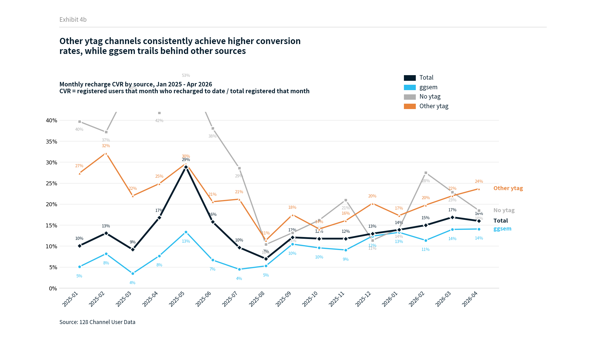
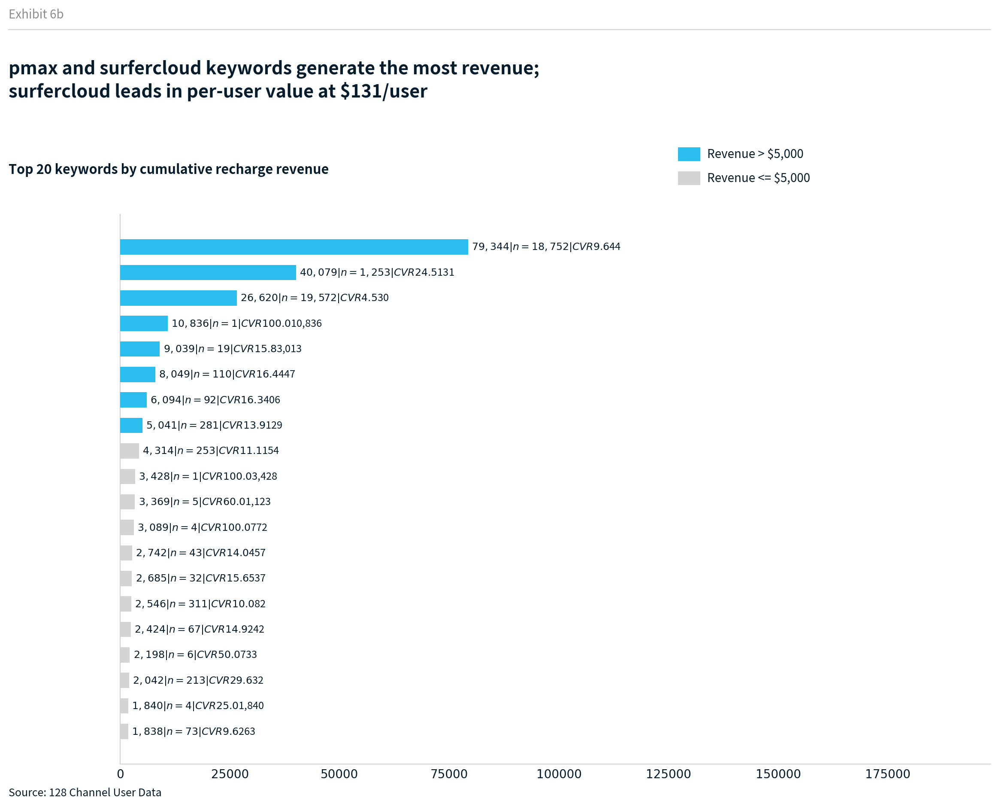
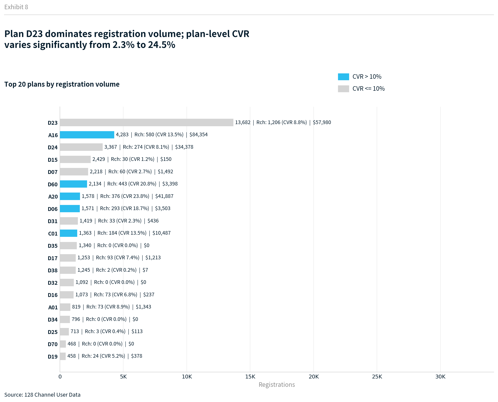
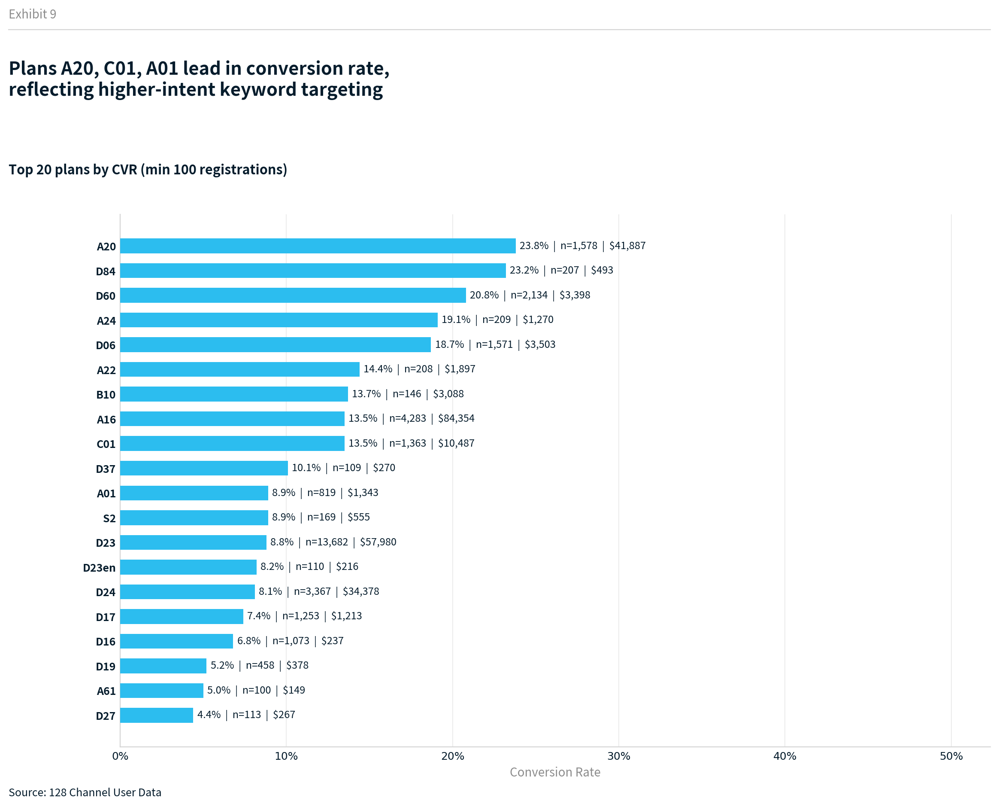
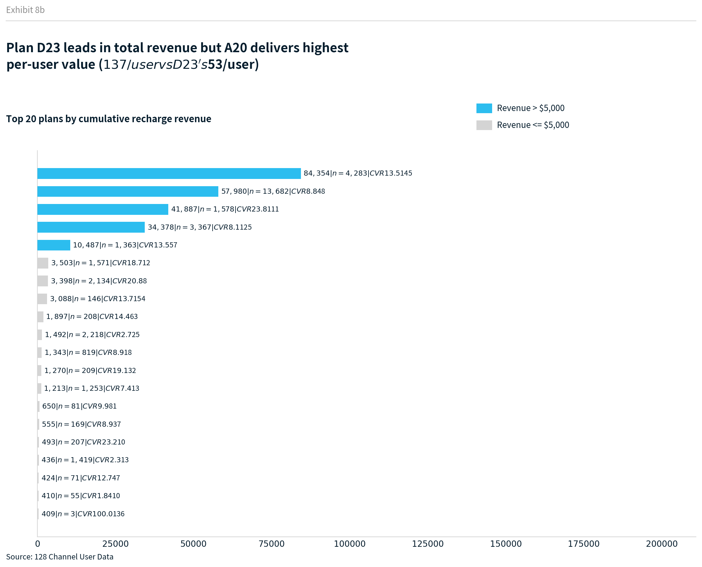
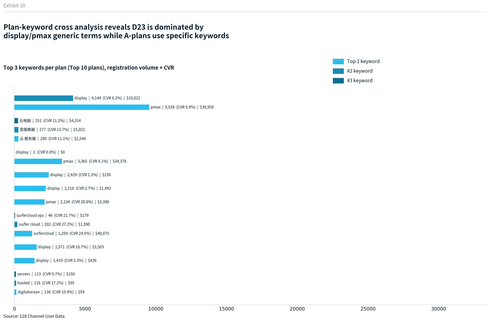

# 128渠道存量用户数据分析报告

> 数据范围：2023-08 ~ 2026-04 | 总用户量：118,831 | 分析时间：2026-04-22
> 注：2024年为平台早期阶段，数据仅作背景参考，重点分析2025年及以后

---

## 一、ytag来源占比分析

### 1.1 整体用户来源分布

| 来源类型 | 用户数 | 占比 | 充值人数 | 充值转化率 | 总收入 |
|---------|--------|------|---------|-----------|--------|
| **No ytag（0或空）** | **63,341** | **53.3%** | 9,479 | 15.0% | $883,723 |
| **ggsem (Google Ads)** | **50,642** | **42.6%** | 4,153 | 8.2% | $254,850 |
| Other ytag（其他渠道） | 4,848 | 4.1% | 1,053 | 21.7% | $272,764 |

> 分类逻辑：综合ytag为0或NaN空值 → No ytag；综合ytag含"ggsem"字符 → ggsem；其余 → Other ytag

**核心发现：**
- 超过一半用户（53.3%）没有ytag归因标记，建议补全追踪
- ggsem是最大的已标记渠道（42.6%），但充值转化率仅8.2%，低于整体均值
- Other ytag（博客推荐、朋友介绍等自然渠道）虽然只有4.1%，但转化率最高达21.7%

### 1.2 ggsem用户中PMax vs Search占比

| 投放类型 | 用户数 | 占ggsem比例 | 充值人数 | 充值转化率 | 总收入 | 人均充值 |
|---------|--------|------------|---------|-----------|--------|---------|
| **PMax** | **38,596** | **76.2%** | 2,680 | 6.9% | $105,963 | $40 |
| **Search** | **12,046** | **23.8%** | 1,473 | 12.2% | $148,887 | $101 |

> 分类逻辑：综合ytag整体含"pmax"或"display"字符 → PMax；其余 → Search

**核心发现：**
- PMax占ggsem的76.2%用户量，是主力拉新引擎
- Search虽然用户量少，但**充值转化率远高于PMax**（12.2% vs 6.9%），总收入也更高（$148,887 vs $105,963）
- Search用户质量明显更优，人均收入$101 vs PMax的$40

---

## 二、月注册量与后期充值转化率趋势

### 2.1 整体注册与充值概览

| 指标 | 数值 |
|------|------|
| 总注册用户 | 118,831 |
| 充值用户 | 14,685 (12.4%) |
| 总充值金额 | $1,411,337 |
| 人均充值金额 | $96 |

### 2.2 分渠道月注册量趋势

ggsem从**2025年1月**起才开始大规模投放，此前注册主要来自No ytag渠道。

| 阶段 | ggsem月均 | No ytag月均 | Other ytag月均 | 总月均 |
|------|----------|------------|---------------|-------|
| 2025-01~2025-12 | 3,280 | 939 | 303 | 4,522 |
| 2026-01~2026-04 | 2,237 | 775 | 295 | 3,307 |

### 2.3 月度注册-充值趋势

> **指标定义：** "充值人数"指**当月注册的用户中，截至数据提取日（2026-04-21）有过任何充值行为的用户数**。"充值转化率"= 充值人数 / 当月注册量。注意：较早注册的用户有更长的充值窗口，因此早期月份转化率天然偏高。

| 月份 | 注册量 | 充值人数 | 充值转化率 |
|------|--------|---------|-----------|
| 2025-01 | 8,238 | 830 | 10.1% |
| 2025-02 | 6,531 | 856 | 13.1% |
| 2025-03 | 9,649 | 889 | 9.2% |
| 2025-04 | 3,479 | 583 | 16.8% |
| 2025-05 | 3,308 | 955 | 28.9% |
| 2025-06 | 4,361 | 687 | 15.8% |
| 2025-07 | 4,555 | 442 | 9.7% |
| 2025-08 | 2,606 | 183 | 7.0% |
| 2025-09 | 2,784 | 338 | 12.1% |
| 2025-10 | 3,163 | 372 | 11.8% |
| 2025-11 | 3,648 | 432 | 11.8% |
| 2025-12 | 4,139 | 538 | 13.0% |
| 2026-01 | 3,665 | 510 | 13.9% |
| 2026-02 | 3,288 | 494 | 15.0% |
| 2026-03 | 3,779 | 638 | 16.9% |
| 2026-04 | 2,496 | 400 | 16.0% |

> 完整月度数据见 `output/monthly_registration_data.csv`
> 分渠道月度数据见 `output/monthly_registration_by_source.csv`

### 2.4 分渠道月度充值转化率趋势

Other ytag渠道的充值转化率持续高于ggsem和No ytag，反映自然渠道用户质量更优。

---

## 三、关键词分析

### 3.1 Top 20关键词（按注册量）

> 注：display和pmax本质属于广告计划类型，不属于明确关键词，已从关键词分析中排除

| 关键词 | 注册量 | 充值人数 | 转化率 | 总收入 |
|--------|--------|---------|--------|--------|
| surfercloud | 1,253 | 307 | 24.5% | $40,079 |
| sitelink1 | 606 | 14 | 2.3% | $391 |
| 云 服务器 | 311 | 31 | 10.0% | $2,546 |
| 雲服務器 | 281 | 39 | 13.9% | $5,041 |
| 云电脑 | 253 | 28 | 11.1% | $4,314 |
| vps hosting | 236 | 46 | 19.5% | $762 |
| cloud server | 213 | 63 | 29.6% | $2,042 |
| surfer cloud | 202 | 55 | 27.2% | $1,590 |
| full version deepseek | 160 | 0 | 0.0% | $0 |
| digitalocean | 140 | 15 | 10.7% | $59 |

### 3.2 高转化关键词排行（最少50注册）

| 关键词 | 转化率 | 注册量 | 总收入 |
|--------|--------|--------|--------|
| cloud server | 29.6% | 213 | $2,042 |
| surfer cloud | 27.2% | 202 | $1,590 |
| surfercloud | 24.5% | 1,253 | $40,079 |
| 云 桌面 | 21.6% | 97 | $777 |
| 美國vps | 21.5% | 93 | $1,366 |
| 國外服務器 | 20.4% | 54 | $1,482 |
| vps hosting | 19.5% | 236 | $762 |

### 3.3 Top 20关键词（按累计充值金额）

surfercloud以$40,079收入排名第一，人均充值$131，是最具商业价值的关键词。

### 3.4 关键词洞察

1. **品牌词效果最好**：surfercloud/surfer cloud/cloud server转化率24-30%，是最高质量关键词
2. **中文关键词有潜力**：雲伺服器(16.4%)、雲服務器(13.9%)、云桌面(21.6%)表现不错，且人均充值高
3. **竞品词值得投入**：digitalocean(10.7%)、vultr(14.8%)带来有明确需求的用户
4. **DeepSeek相关词零转化**：full version deepseek(160注册/0充值)、deepseek api(101注册/0充值)，纯蹭热度流量，建议加入否定关键词
5. **sitelink1转化极低**：606注册但CVR仅2.3%，需排查投放策略

---

## 四、计划维度分析

### 4.1 Top 20计划（按注册量）

> 仅统计计划字段非0/非空的用户

**关键发现：**
- **D23**是最大计划（13,682注册），但CVR仅8.8%，以pmax/display泛词为主
- **A20**注册量1,578但CVR高达23.4%，以品牌词surfercloud为主，总收入$41,905
- **D60**的CVR达20.8%，是D系列计划中转化最优的

### 4.2 高转化计划排行（最少100注册）

### 4.3 Top 20计划（按累计充值金额）

A16以$84,354总收入排名第一（人均$145），远超注册量最大的D23（$57,980，人均$48）。

### 4.4 计划×关键词交叉分析

不同计划对应了不同的关键词组合，计划与关键词是包含与被包含的关系。

#### 完整数据表（CVR > 10% 且注册量 > 50，共23条）

| 计划 | 关键词 | 注册量 | 充值人数 | 总收入 | CVR | 人均充值 |
|------|--------|--------|---------|--------|-----|---------|
| **A20** | surfer cloud | 202 | 55 | $1,590 | 27.2% | $29 |
| **A20** | surfercloud | 1,250 | 306 | $40,075 | 24.5% | $131 |
| **A16** | 云 桌面 | 97 | 21 | $777 | 21.6% | $37 |
| **A16** | 美國vps | 91 | 19 | $1,349 | 20.9% | $71 |
| **D60** | pmax | 2,134 | 443 | $3,398 | 20.8% | $8 |
| **A16** | 國外服務器 | 54 | 11 | $1,482 | 20.4% | $135 |
| **A16** | 香港雲主機 | 73 | 14 | $1,619 | 19.2% | $116 |
| **D06** | display | 1,571 | 293 | $3,503 | 18.7% | $12 |
| **C01** | hosted | 116 | 20 | $95 | 17.2% | $5 |
| **A16** | vps 服务器 | 53 | 9 | $289 | 17.0% | $32 |
| **A16** | 輕量雲服務器 | 91 | 15 | $6,094 | 16.5% | $406 |
| **A16** | 雲伺服器 | 108 | 17 | $8,043 | 15.7% | $473 |
| **A16** | 服務器海外 | 67 | 10 | $2,424 | 14.9% | $242 |
| **C01** | vultr | 111 | 16 | $88 | 14.4% | $6 |
| **A16** | 香港服务器 | 57 | 8 | $1,245 | 14.0% | $156 |
| **A16** | 雲服務器 | 277 | 38 | $5,021 | 13.7% | $132 |
| **A16** | vps 服务器 推荐 | 59 | 8 | $146 | 13.6% | $18 |
| **A16** | 雲主機 | 78 | 10 | $409 | 12.8% | $41 |
| **A16** | vps 服务商 | 60 | 7 | $889 | 11.7% | $127 |
| **A16** | 云电脑 | 251 | 28 | $4,314 | 11.2% | $154 |
| **A16** | 云 服务器 | 280 | 31 | $2,546 | 11.1% | $82 |
| **C01** | digitalocean | 138 | 15 | $59 | 10.9% | $4 |
| **C01** | vpsserver | 85 | 9 | $78 | 10.6% | $9 |

#### 计划摘要

| 计划 | 主力关键词 | 关键词CVR | 计划特征 |
|------|-----------|----------|---------|
| **A20** | surfercloud(1,250) / surfer cloud(202) | 24.5% / 27.2% | 品牌词，质量最优 |
| **A16** | 云服务器(280) / 雲服務器(277) / 云电脑(251) | 11-22% | 中文长尾词，质量稳定 |
| **D60** | pmax(2,134) | 20.8% | PMax中的优质计划 |
| **D06** | display(1,571) | 18.7% | Display中的优质计划 |
| **C01** | digitalocean(138) / hosted(116) / vultr(111) | 10-17% | 竞品词，中等转化 |
| **D23** | pmax(9,538) / display(4,144) | 9.9% / 6.2% | 泛流量，量大质一般 |
| **D24** | pmax(3,365) | 8.1% | PMax中等计划 |
| **D15** | display(2,429) | 1.2% | ⚠️ Display最差计划 |
| **D31** | display(1,419) | 2.3% | ⚠️ Display低效计划 |
| **D07** | display(2,218) | 2.7% | ⚠️ Display低效计划 |

#### 💰 高客单价关键词（人均充值 Top 5）

| 关键词 | 计划 | 注册量 | 人均充值 | 总收入 |
|--------|------|--------|---------|--------|
| 雲伺服器 | A16 | 108 | **$473** | $8,043 |
| 輕量雲服務器 | A16 | 91 | **$406** | $6,094 |
| 服務器海外 | A16 | 67 | **$242** | $2,424 |
| 香港服务器 | A16 | 57 | **$156** | $1,245 |
| 云电脑 | A16 | 251 | **$154** | $4,314 |

> A16计划的繁体中文关键词客单价极高，輕量雲服務器和雲伺服器人均充值超$400，是品牌词surfercloud($131)的3倍以上。

**交叉分析洞察：**
1. **A系列计划质量明显优于D系列**：A20(23.4%)、A16(多词10-22%) vs D15(1.2%)、D31(2.3%)
2. **同为PMax，D60(20.8%) vs D24(8.1%)**差异巨大，需排查投放策略差异
3. **D15/D31/D07三个Display计划CVR均<3%**，建议优先优化或暂停
4. **C01竞品词计划**转化10-17%且覆盖多个竞品关键词，可考虑扩大投放

> 完整计划数据见 `output/plan_analysis_data.csv`
> 计划×关键词交叉数据见 `output/plan_keyword_cross_data.csv`

---

## 五、核心建议

### 🔴 立即行动
1. **补全ytag追踪**：53.3%用户无来源标记，严重影响归因分析和ROI计算
2. **优化或暂停低效Display计划**：D15(CVR 1.2%)、D31(2.3%)、D07(2.7%)消耗预算但产出极低

### 🟡 短期优化
3. **加大品牌词/A系列计划投入**：A20的surfercloud系列CVR 24%+，人均充值高
4. **砍掉零转化关键词**：deepseek相关词带来注册但0充值，建议加入否定关键词
5. **拓展中文长尾词**：A16计划的中文词（云桌面、云电脑）CVR 10-22%，有扩量空间
6. **研究D60的成功经验**：同为PMax但CVR 20.8%，远超其他D系列，值得复制其投放策略

### 🟢 长期策略
7. **Search vs PMax预算再分配**：Search CVR(12.2%)是PMax(6.9%)的近两倍，人均收入$101 vs $40，考虑加大Search预算占比
8. **重新评估ggsem整体ROI**：ggsem转化率仅8.2%，而Other ytag 4,848人带来$272,764收入，自然渠道性价比远高于付费
9. **激活存量低转化用户**：针对早期低转化月份注册的存量用户做定向激活运营

---

*报告生成时间：2026-04-22 | 数据来源：128渠道存量用户数据表*
