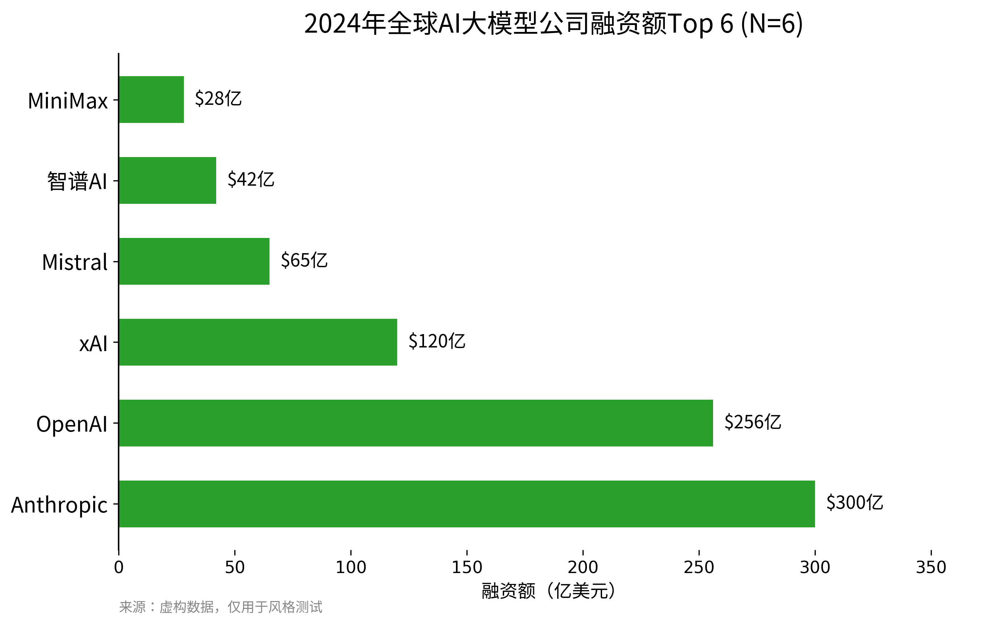
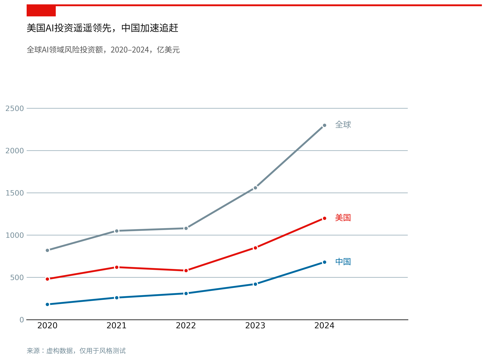
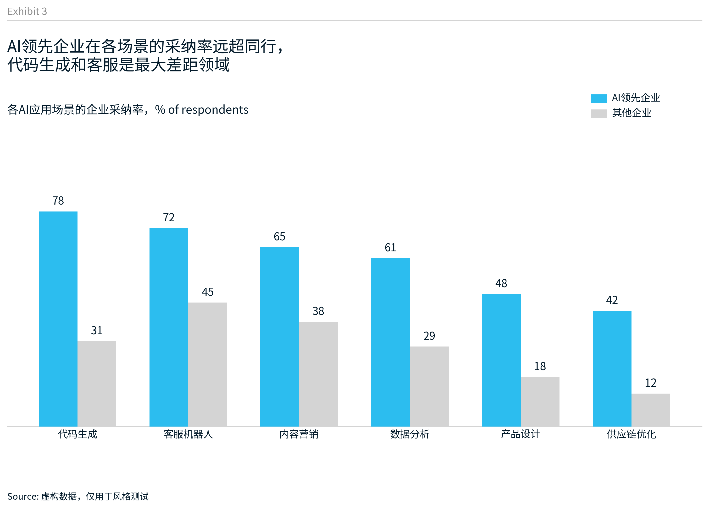

# Data Visualization Skill 测试

三套专业报告风格图表的测试输出，数据均为虚构。

## 效果展示

### 1. BCG 风格 — AI大模型公司融资额Top 6

绿色极简，标题含样本量 `(N=6)`，去除多余边框，适合研究报告。

### 2. The Economist 风格 — 中美AI投资趋势（2020-2024）

标志性顶部红线 + 红色方块 tag，重点系列上色、对照灰化，末端标注替代图例。

### 3. McKinsey 风格 — AI领先企业 vs 其他企业应用采纳率

"Exhibit 3" 编号 + 细分隔线，亮青 vs 浅灰对照，超大结论句标题，窄柱设计。

## 代码

每张图对应一个完整可运行的 Python 脚本：

- `test_viz_bcg.py`
- `test_viz_economist.py`
- `test_viz_mckinsey.py`
